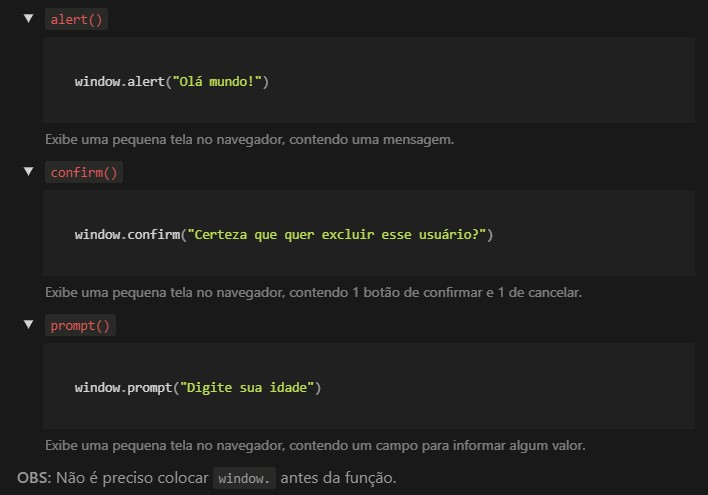

# Índice das Aulas Javascript Básico
Link dos <a href="https://www.notion.so/Javascript-B-sico-72e0f87d21f44079b5af798419f857a2">resumos</a>. 

<!-- TABLE OF CONTENTS -->
## Conteúdo
<ul>
    <li>
        <a href="#aula-01-Primeiro-Código">Aula 01 - Primeiro Código (Comando: window)</a>
    </li>
</ul>

## Aula 01 - Primeiro Código

